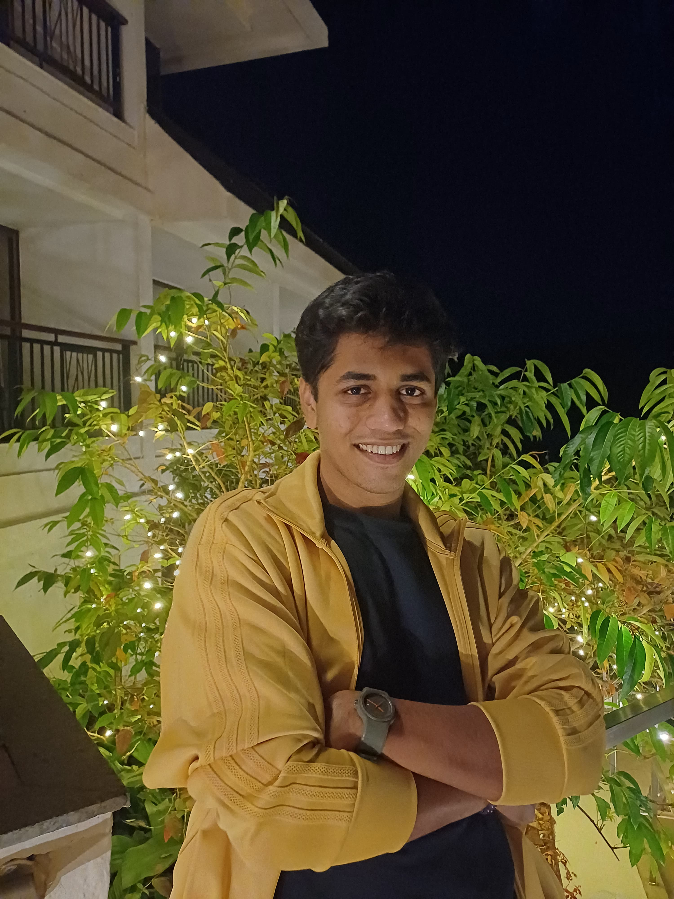

 

Hey there👋🏽, I'm a developer, an AI and Data Science undergrad. I usually like spending my time reading about building useful products, connecting with tech community on twitter/discord, swimming and riding my bike.

________________________________________

here are some of my works-
1.	[Spotify Data Rescue](https://github.com/aryan4ai/Spotify-Data-Rescue)
2.	[Multiple PDF Chat Companion](https://github.com/aryan4ai/Multiple-PDF-Chat-Companion)
3.	[Lane Line Detection using AI](https://github.com/aryan4ai/Lane-Line-Detection-using-AI)
4.	[Customer-Segmentation-using-K-means-algorithm-and-PCA](https://github.com/aryan4ai/Customer-Segmentation-using-K-means-algorithm-and-PCA)

________________________________________

Connect:

    
